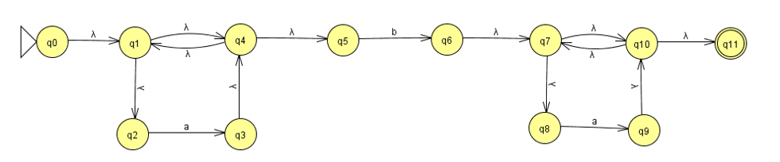

# Datos personales

•	**Institución:** Universidad politécnica de San Luis Potosí

•	**Matricula:** 170201

•	**Alumno:** Juan Humberto Herrera Martínez

•	**Carrera:** Ingeniería en Tecnologías de la Información

•	**Materia:** Teoría computacional

•	**Docente:** Juan Carlos González Ibarra 

# Notas:

   - El nombre del proyecto es 170201_nfa, cuenta con el codigo fuente y lo necesario para ejecutar un proyecto Rust
   - Para exportar la librería Regex se necesita que el programa esté en formato de proyecto
   - El nombre del archivo fuente es main.rs para cumplir con esta condición. 

# Objetivos 
1.	En este programa se identificó el autómata finito no determinista correspondiente a la expresión regular "a* b a*"
2.	A partir del autómata se determinó la tabla de transiciones correspondiente.
3.	Se codificó el domportamiento del NFA con respecto a la expresión deseada.

### Expresiones a utilizar:
   - (a) para solo introducir la letra a.
   - (b) para solo introducir la letra b.

### Automata correspondiente a la expreción a*ba*:
Para obtener el automata primero se debe de descomponer la expresión regular en sus forma primitivas mas simples.
Para a* segun el teorema de la estrella de Kleene se debe de entrelazar todas las posibles transiciones mediante una cadena vacía.

Para b es más simple, puesto que solo se requiere una transición.

Posteriormente, mediante el teorema de la concatenación se agrega un estado al inicio apuntando a vacío entre los estados iniciales y finales de cada autómata a concatenar.


### Tabla de transiciones
| Estado | ε| a| b| Fin de cadena |
| --- | ---: | :---: |  :---: |  :---: |
| q0 | q1 | Error | Error |  Error |
| q1 | q2,q4 | Error | Error |  Error |
| q2 | Error | q3 | Error |  Error |
| q3 | q4 | Error | Error |  Error |
| q4 | q5,q1 | Error | Error |  Error |
| q5 | Error | Error | q6|  Error |
| q6 | q7 | Error | Error |  Error |
| q7 | q10,q8 | Error | Error |  Error |
| q8 | Error | q9 | Error |  Error |
| q9 | q10 | Error | Error |  Error |
| q10 | q11,q7 | Error | Error |  Error |
| qf | Error | Error | Error | Aceptacion |


### Ejemplo para Tabla de estados:
	+-------------------------------------+
	|    Ingrese una cadena a evaluar:    |
	+-------------------------------------+
	aba
	+--------------+---------+-----------+---------------+
	|  Edo. Actual |Caracter |  Simbolo  |Edo. Siguiente |
	+--------------+---------+-----------+---------------+
	|      0       |         |           |       1       |
	+--------------+---------+-----------+---------------+
	|      1       |         |           |       2       |
	+--------------+---------+-----------+---------------+
	|      2       |    a    |     a     |       3       |
	+--------------+---------+-----------+---------------+
	|      3       |         |           |       4       |
	+--------------+---------+-----------+---------------+
	|      4       |         |           |       5       |
	+--------------+---------+-----------+---------------+
	|      5       |    b    |     b     |       6       |
	+--------------+---------+-----------+---------------+
	|      6       |         |           |       7       |
	+--------------+---------+-----------+---------------+
	|      7       |         |           |       8       |
	+--------------+---------+-----------+---------------+
	|      8       |    a    |     a     |       9       |
	+--------------+---------+-----------+---------------+
	|      9       |         |           |       10      |
	+--------------+---------+-----------+---------------+
	|      10      |         |           |       11      |
	+--------------+---------+-----------+---------------+
	|      11      |         |Fin Cadena |               |
	+--------------+---------+-----------+---------------+
	|                Cadena Valida                       |
	+----------------------------------------------------+


# Como solucionaste el problema
Dentro de Rust se puede instanciar a la librería Regex. Ésta proporciona una biblioteca para analizar, compilar y ejecutar expresiones regulares. Su sintaxis es similar a las expresiones regulares de estilo Perl, pero carece de algunas características como mirar alrededor y referencias inversas. A cambio, todas las búsquedas se ejecutan en tiempo lineal con respecto al tamaño de la expresión regular y el texto de búsqueda.
Lo siguiente fue realizar las modificaciónes necesarias al programa AFD antes realizado.


### NFA.

•	*Cargo.TOML*

	[package]
	name = "nfa"
	version = "0.1.0"
	authors = ["JuanH13 <170201@upslp.edu.mx>"]
	edition = "2018"

	[dependencies]
	regex = "1"


•	*Librerías necearias*

```Rust
	//Llamada a la librería de expresiones rgulares
	extern crate regex;

	//Invocación de los librerías 
	use std::io;        //Entradas por teclado
	use regex::Regex;   //Expresiones regulares
	use std::process;   //Procesos
```
 
•	*Funsión para validar caracteres*

```Rust
    	//Función para verificar entradas mediante expresiones regulares
	fn caracter(character: char, estado:i32) -> i32
	{
		let fin="\r";
		let a = Regex::new(r"a").unwrap();  //Expresión regular para a*
		let b = Regex::new(r"b").unwrap();  //Expresión regular para b
    
		//Pasar caracter a una cadena
		let mut s: String = "".to_string();;
		s.push(character);
		let new_character: &str = &s[..];

		//Si se recibe cualquier estado correspondiente al vacío devielve 0
		if estado == 0 || estado == 1 || estado == 3 || estado == 4 || estado == 6 || estado == 7 || estado == 9 || estado == 10 
		{
			return 0;
		} 

		//Si recibe el estado final muestra que la cadena es valida automáticamente
		if estado == 11
		{
			println! ("|      {}      |         |Fin Cadena |               |",estado);
			body();
			println! ("|                Cadena Valida  :D                   |");
			println! ("+----------------------------------------------------+");
			process::exit(0x0100);
		}

		//comparamos si la entrada es a o b
		if a.is_match(new_character)
		{
			return 1;       //a
		}
		else 
		{
			if b.is_match(new_character) 
			{
				return 2;       //b
			}
			else 
			{
				if new_character==fin
				{
					return 3;       //Fin de cadena
				}
			}

			//si no es ni una a ni una b entonces es un caracter no valido
			println!("Error el caracter: {} no es valido",character);
			process::exit(0x0100);
		}    
	}

```

•	*Funciones de impresión de datos*

```Rust
	//definimos al la funcion  encabezado
	fn encabezado()
	{
	    println! ("|  Edo. Actual |Caracter |  Simbolo  |Edo. Siguiente |");
	    body();
	}

	//definimos la funcion contenido donde guarda cada valor despues de encontrarlo en un ciclo
	fn contenido(estadosig: i32,character: char,simbolo: &str,estado: i32)
	{
	    println! ("|      {}       |    {}    | {}|       {}       |",estadosig,character,simbolo,estado);
	    body();
	}
	//solo muestra la linea que se repetira cada vez que la mandemos a llamar
	fn body()
	{
	    println! ("+--------------+---------+-----------+---------------+");
	}   
```

•	*Función principal*

```Rust
	fn main()
	{
		//Este es la tabla de transiciones del automata NFA creado
		let tabla: Vec<Vec<char>>;
		tabla = vec![
				vec! ['1','E','E','E'],     // q0
				vec! ['2','E','E','E'],     // q1
				vec! ['E','3','E','E'],     // q2
                		vec! ['4','E','E','E'],     // q3
                		vec! ['5','E','E','E'],     // q4
                		vec! ['E','E','6','E'],     // q5
                		vec! ['7','E','E','E'],     // q6
                		vec! ['8','E','E','E'],     // q7
                		vec! ['E','9','E','E'],     // q8
                		vec! ['a','E','E','E'],     // q9
                		vec! ['b','E','E','E'],     // q10
                		vec! ['E','E','E','A']      // q11
            		];
    
		//Define el estado inical
		let mut estado: i32 = 0;
    
		// Entrada de datos por teclado
		let mut simbolo: String = "".to_string();
		println! ("+-------------------------------------+");
		println! ("|    Ingrese una cadena a evaluar:    |");
		println! ("+-------------------------------------+");
		let mut cadena = String::new();		
		io::stdin().read_line(&mut cadena);

		//Comienza la impresión de la tabla
		body();
		encabezado();

		//ciclo para recorrer la cadena
		for  character in cadena.chars()
		{
			//llamamos al metodo para saber si es un caracter valido y el valor retornado se guarda en charcaracter
			let mut charcaracter = caracter(character,estado);

			while charcaracter == 0
			{
				let  estadosig: i32 = estado;
				//guardamos en estado el valor obtenido en la tabla segun las cordenadas que recibio anteriormente
				estado =  (tabla[ estado as usize][charcaracter as usize]) as i32 - '0' as i32 ;

				/////////////Para la recurción en caso de que halla vacío ante o después de b/////////////
            
				if estadosig == 1  && character == 'b'  //Si está en q1 y sigue b
				{
					estado = 4;                         //Salta a q4
				}

				if estadosig == 7  && character == '\r' //Si está en q7 y sigue el fin de cadena
				{
					estado = 10;                         //Salta a q10
				}

				/////////////Para la recurción de a*/////////////
				if estadosig == 4  && character != 'b' //Si está en q4 y no sigue b
				{
					estado = 1;                         //Regresa a q1
				}

				if estadosig == 10  && character != '\r' //Si está en q10 y no sigue el fin de cadena
				{
					estado = 7;                         //Regresa a q7
				}
            
				//Si llega a q9 y el estado siguiente corresponde a 10, denotado con el caracter 'a'
				if(estado == 49)
				{   
					estado=10;      //Marca el estado siguiente como 10
				}
				//Si llega a q10 y el estado siguiente corresponde a 11, denotado con el caracter 'b'
				if(estado == 50)
				{
					estado=11;      //Marca el estado siguiente como 10
				}

				//Muestra en la tabla lo correspondiente a vacío
				contenido(estadosig,' ',&"          ".to_string(),estado);

				//Vuelve a calcular charcaracter
				charcaracter = caracter(character,estado);
			}

			// Se recalcula el estado y el estado siguiente segun la tabla de tranición
			let  estadosig: i32 = estado;
			estado =  (tabla[ estado as usize][charcaracter as usize]) as i32 - '0' as i32 ;

			//Identifica el smibolo a o b
			if charcaracter == 1    
			{
				simbolo = "    a     ".to_string();
			}
			else if charcaracter == 2
			{
				simbolo = "    b     ".to_string();
			}
			else if charcaracter == 3
			{
				simbolo = "Fin Cadena".to_string();
			}

			//Si el valor obtenido es una E imprimimos cadena no valida
			if estado==21
			{
				let mut character_imp = character;
				if character_imp == '\r'
				{
					character_imp = ' ';
				}
				println! ("|      {}       |    {}    |{} |     Error     |",estadosig,character_imp,simbolo);
				body();
				println! ("|              Cadena No Valida :(                   |");
				println! ("+----------------------------------------------------+");
				process::exit(0x0100);
			}
			contenido(estadosig,character,&simbolo,estado); 
		}  
	}	

```


# Problemas y soluciones al programar 

Un Vector no puede contener datos de multiples tipos por lo que para manejar los estados se utilizaron valores de tipo char

```Rust
	tabla = vec![
                vec! ['1','E','E','E'],     // q0
                vec! ['2','E','E','E'],     // q1
                vec! ['E','3','E','E'],     // q2
                vec! ['4','E','E','E'],     // q3
                vec! ['5','E','E','E'],     // q4
                vec! ['E','E','6','E'],     // q5
                vec! ['7','E','E','E'],     // q6
                vec! ['8','E','E','E'],     // q7
                vec! ['E','9','E','E'],     // q8
                vec! ['a','E','E','E'],     // q9
                vec! ['b','E','E','E'],     // q10
                vec! ['E','E','E','A']      // q11
            ];
```

Para manejar los estados que recorre el automata con el contenido de la tabla de estados fue necesario realizar operaciones y conversión de datos.

```Rust
	//guardamos en estado el valor obtenido en la tabla segun las cordenadas que recibio anteriormente
        estado = (tabla[estado as usize][charcaracter as usize]) as i32 - '0' as i32;
```

Para manejar las traniciones vacías dentro autómata se utilizó un condicional con todos lo estados que utilizan estas transiciones

```Rust
	//Si se recibe cualquier estado correspondiente al vacío devielve 0
	if estado == 0 || estado == 1 || estado == 3 || estado == 4 || estado == 6 || estado == 7 || estado == 9 || estado == 10 
	{
		return 0;
	} 
```

Se utilizaron dos condicionales para manejar las recursiones de las traniciones de q1 a q4 y q7 a q10

```Rust
	/////////////Para la recurción en caso de que halla vacío ante o después de b/////////////
            
        if estadosig == 1  && character == 'b'  //Si está en q1 y sigue b
        {
            estado = 4;                         //Salta a q4
        }

        if estadosig == 7  && character == '\r' //Si está en q7 y sigue el fin de cadena
        {
            estado = 10;                         //Salta a q10
        }

        /////////////Para la recurción de a*/////////////
        if estadosig == 4  && character != 'b' //Si está en q4 y no sigue b
        {
            estado = 1;                         //Regresa a q1
        }

        if estadosig == 10  && character != '\r' //Si está en q10 y no sigue el fin de cadena
        {
            estado = 7;                         //Regresa a q7
        }
```

Para manejar estados de dos digitos dentro de la tabla de transiciones se utilizó su equivalente en hexadecimal para cumplir con un unico caracter para 10 y 11 se usó a y b respectivamente. Se usaron conversiones numericas para imprimirlos.

```Rust
	//Si llega a q9 y el estado siguiente corresponde a 10, denotado con el caracter 'a'
        if(estado == 49)
        {   
            estado=10;      //Marca el estado siguiente como 10
        }
        //Si llega a q10 y el estado siguiente corresponde a 11, denotado con el caracter 'b'
        if(estado == 50)
        {
            estado=11;      //Marca el estado siguiente como 10
        } 
```

Al identificar el fin de cadena algunas de las funciones trataban de imprimirlo, lo que generaba que la información no apareciera ordenada. Para solucionarlo se identificó los momentos en los que la cadena era finita mediante la expresión '\r'
```Rust
	let fin="\r";
```